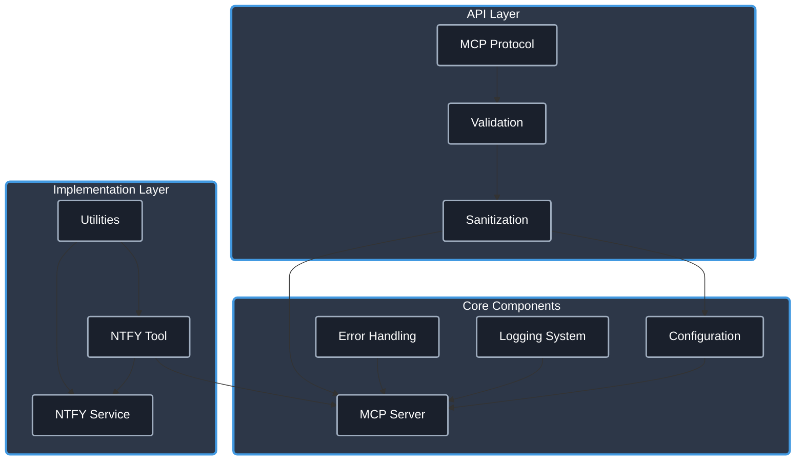

# NTFY MCP Server

[](https://www.typescriptlang.org/)
[](https://modelcontextprotocol.io/)
[]()
[](https://opensource.org/licenses/Apache-2.0)
[](https://github.com/cyanheads/mcp-ts-template/issues)
[](https://github.com/cyanheads/mcp-ts-template)

A powerful [Model Context Protocol (MCP)](https://modelcontextprotocol.io/) server for integrating [ntfy](https://ntfy.sh/) notification services with AI systems. This server enables AI models to send notifications to various devices through the ntfy publish/subscribe service.

Use this server to empower your AI assistants to send real-time notifications to phones, desktops, and other devices!

## Using this server will get you:

- **Notification Capabilities**: Send instant notifications from AI systems to any device with ntfy integration.
- **Rich Message Formatting**: Support for titles, tags, priorities, action buttons, and attachments.
- **Type Safety**: Strong typing with TypeScript to catch errors at compile time.
- **Security**: Built-in security features to protect against common vulnerabilities.
- **Error Handling**: A robust error handling system that categorizes and formats errors consistently.
- **Subscription Support**: Listen for incoming notifications (future feature).

> **.clinerules**: This repository includes a [.clinerules](.clinerules) file that serves as a developer cheat sheet for your LLM coding agent with quick reference for the codebase patterns, file locations, and code snippets.

## Table of Contents

- [Overview](#overview)
  - [What is NTFY?](#what-is-ntfy)
  - [Architecture & Components](#architecture--components)
- [Features](#features)
  - [Core Utilities](#core-utilities)
  - [Type Safety](#type-safety)
  - [Error Handling](#error-handling)
  - [Security](#security)
- [Installation](#installation)
- [Configuration](#configuration)
- [Project Structure](#project-structure)
- [Tool Documentation](#tool-documentation)
  - [Send NTFY](#send-ntfy)
- [Development Guidelines](#development-guidelines)
  - [Adding Advanced Features](#adding-advanced-features)
- [Future Plans](#future-plans)
- [License](#license)

## Overview

### What is NTFY?

[NTFY](https://ntfy.sh/) is a simple HTTP-based pub-sub notification service that enables sending push notifications to your phone or desktop via scripts from any computer. It works without signing up or installing an app, using simple HTTP requests to trigger notifications.

This MCP server wraps NTFY's functionality in a standardized Model Context Protocol interface, allowing AI systems to:

- Send notifications to any device with the ntfy app or integration
- Configure notification options like priority, tags, and actions
- Schedule delayed notifications
- Attach images or files to notifications (via URLs)
- Add action buttons to notifications

### Architecture & Components

The server follows a modular architecture designed for clarity and extensibility:

<details>
<summary>Click to expand architecture diagram</summary>



</details>

Core Components:

- **Configuration System**: Environment-aware configuration with validation
- **Logging System**: Structured logging with sensitive data redaction
- **Error Handling**: Centralized error processing with consistent patterns
- **MCP Server**: Protocol implementation for tools
- **NTFY Service**: Core service for interacting with the ntfy API
- **Validation Layer**: Input validation using schemas
- **Utilities**: Reusable utility functions for common operations

## Features

### Core Utilities

- **Logging**: Configurable logging with file rotation and sensitive data redaction
- **Error Handling**: Pattern-based error classification and standardized reporting
- **ID Generation**: Secure unique identifier creation with prefix support
- **Rate Limiting**: Request throttling to prevent API abuse
- **Request Context**: Request tracking and correlation
- **Sanitization**: Input validation and cleaning

### Type Safety

- **Global Types**: Shared type definitions for consistent interfaces
- **Error Types**: Standardized error codes and structures
- **MCP Protocol Types**: Type definitions for the MCP protocol
- **Tool Types**: Interfaces for tool registration and configuration
- **NTFY Types**: Specialized types for ntfy notification parameters

### Error Handling

- **Pattern-Based Classification**: Automatically categorize errors based on message patterns
- **Consistent Formatting**: Standardized error responses with additional context
- **Error Mapping**: Custom error transformation for domain-specific errors
- **Safe Try/Catch Patterns**: Centralized error processing helpers

### Security

- **Input Validation**: Schema-based validation using Zod
- **Input Sanitization**: Protection against injection attacks
- **Parameter Bounds**: Enforced limits to prevent abuse
- **Sensitive Data Redaction**: Automatic redaction in logs

## Installation

### Prerequisites

- [Node.js (v18+)](https://nodejs.org/)
- [npm](https://www.npmjs.com/) or [yarn](https://yarnpkg.com/)

### Setup

1. Clone this repository:

   ```bash
   git clone https://github.com/cyanheads/ntfy-mcp-server.git
   cd ntfy-mcp-server
   ```

2. Install dependencies:

   ```bash
   npm install
   ```

3. Configure environment variables (see [Configuration](#configuration))

4. Build the project:

   ```bash
   npm run build
   ```

5. Start the server:
   ```bash
   npm run start
   ```

## Configuration

### Environment Variables

Create a `.env` file based on `.env.example`:

```bash
# Server Configuration
NODE_ENV=development # development, production
LOG_LEVEL=info # debug, info, warn, error

# NTFY Configuration
NTFY_BASE_URL=https://ntfy.sh # the ntfy server base URL (default: https://ntfy.sh)
NTFY_DEFAULT_TOPIC=your-topic # your default ntfy topic (required)
NTFY_API_KEY=your-api-key # optional API key for reserved topics

# Rate Limiting
RATE_LIMIT_WINDOW_MS=60000
RATE_LIMIT_MAX_REQUESTS=100
```

### Configuration System

The configuration system provides a flexible way to manage settings:

- **Environment Config**: Load settings from environment variables
- **MCP Servers Config**: Configure MCP server connections (for future client implementations)
- **Lazy Loading**: Configurations are loaded only when needed

## Project Structure

The codebase follows a modular structure:

```bash
src/
├── config/                  # Configuration management
│   ├── envConfig.ts         # Environment variable handling
│   ├── index.ts             # Unified configuration
│   └── mcpConfig.ts         # MCP server configuration
│
├── mcp-server/              # MCP server implementation
│   ├── tools/               # Tool implementations
│   │   └── ntfyTool/        # NTFY notification tool
│   └── utils/               # Server utilities
│       └── registrationHelper.ts  # Registration helpers
│
├── services/                # Core services
│   └── ntfy/                # NTFY service implementation
│       ├── publisher.ts     # Notification publishing
│       ├── subscriber.ts    # Notification subscribing
│       ├── types.ts         # NTFY-specific types
│       └── utils.ts         # NTFY utility functions
│
├── types-global/            # Shared type definitions
│   ├── errors.ts            # Error types and codes
│   ├── mcp.ts               # MCP protocol types
│   └── tool.ts              # Tool registration types
│
├── utils/                   # Common utilities
│   ├── errorHandler.ts      # Error handling
│   ├── idGenerator.ts       # ID generation
│   ├── logger.ts            # Logging system
│   ├── rateLimiter.ts       # Rate limiting
│   ├── requestContext.ts    # Request context
│   ├── sanitization.ts      # Input sanitization
│   └── security.ts          # Security utilities
│
└── index.ts                 # Application entry point
```

## Tool Documentation

### Send NTFY

The `send_ntfy` tool allows sending notifications to any device with ntfy integration.

#### Parameters

| Parameter  | Type       | Description                                             | Required |
| ---------- | ---------- | ------------------------------------------------------- | -------- |
| topic      | string     | The ntfy topic to send the notification to              | Yes      |
| message    | string     | The notification message body                           | Yes      |
| title      | string     | The notification title                                  | No       |
| tags       | string[]   | Tags that appear as emojis (e.g., ["warning", "robot"]) | No       |
| priority   | number     | Message priority (1-5, where 5 is highest)              | No       |
| click      | string     | URL to open when notification is clicked                | No       |
| actions    | Action[]   | Action buttons to display in the notification           | No       |
| attachment | Attachment | Attachment URL and optional name                        | No       |
| email      | string     | Email address to send the notification to               | No       |
| delay      | string     | Delay the message (e.g., "30m", "1h", "tomorrow")       | No       |
| markdown   | boolean    | Whether to format the message as markdown               | No       |
| baseUrl    | string     | Base URL for the ntfy server (default: https://ntfy.sh) | No       |

#### Usage Example

```json
{
  "topic": "my-topic",
  "message": "Server deployment completed successfully!",
  "title": "Deployment Status",
  "tags": ["white_check_mark", "rocket"],
  "priority": 3,
  "actions": [
    {
      "id": "view",
      "label": "View Dashboard",
      "action": "view",
      "url": "https://dashboard.example.com"
    }
  ]
}
```

## Development Guidelines

### Adding Advanced Features

1. Extend the NTFY service in `src/services/ntfy/`
2. Add new parameters or functionality to the tool in `src/mcp-server/tools/ntfyTool/`
3. Ensure proper validation and error handling for new features
4. Update the type definitions as needed

Example of extending the tool:

```typescript
// In your ntfyTool/index.ts
server.tool(
  "send_ntfy",
  {
    topic: z
      .string()
      .min(1)
      .describe("The ntfy topic to send the notification to"),
    message: z.string().min(1).describe("The message to send"),
    // Add your new parameters here
    customSound: z
      .string()
      .optional()
      .describe("Custom sound for the notification"),
  },
  async (params) => {
    // Implement handling for the new parameter
    const result = await ntfyService.send({
      ...params,
      // Process new parameters as needed
    });

    return {
      content: [{ type: "text", text: JSON.stringify(result) }],
    };
  }
);
```

## Future Plans

This server serves as a foundation for:

- **Subscription Support**: Listen for incoming notifications on specific topics
- **Web Hook Integration**: Allow callbacks for notification events
- **Multiple Service Support**: Add support for additional notification services
- **Enhanced Message Formatting**: Add support for rich text and interactive elements

## License

This project is licensed under the Apache License 2.0 - see the [LICENSE](LICENSE) file for details.

```
Copyright 2025 Casey Hand @cyanheads

Licensed under the Apache License, Version 2.0 (the "License");
you may not use this file except in compliance with the License.
You may obtain a copy of the License at

    http://www.apache.org/licenses/LICENSE-2.0

Unless required by applicable law or agreed to in writing, software
distributed under the License is distributed on an "AS IS" BASIS,
WITHOUT WARRANTIES OR CONDITIONS OF ANY KIND, either express or implied.
See the License for the specific language governing permissions and
limitations under the License.
```

---

<div align="center">
Built with the <a href="https://modelcontextprotocol.io/">Model Context Protocol</a>
</div>
